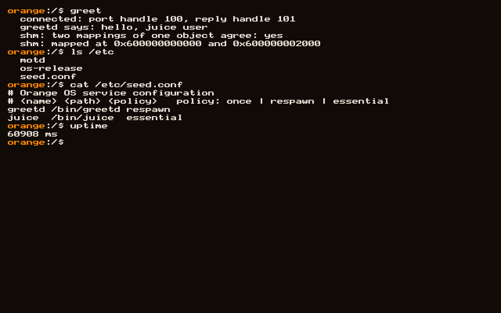
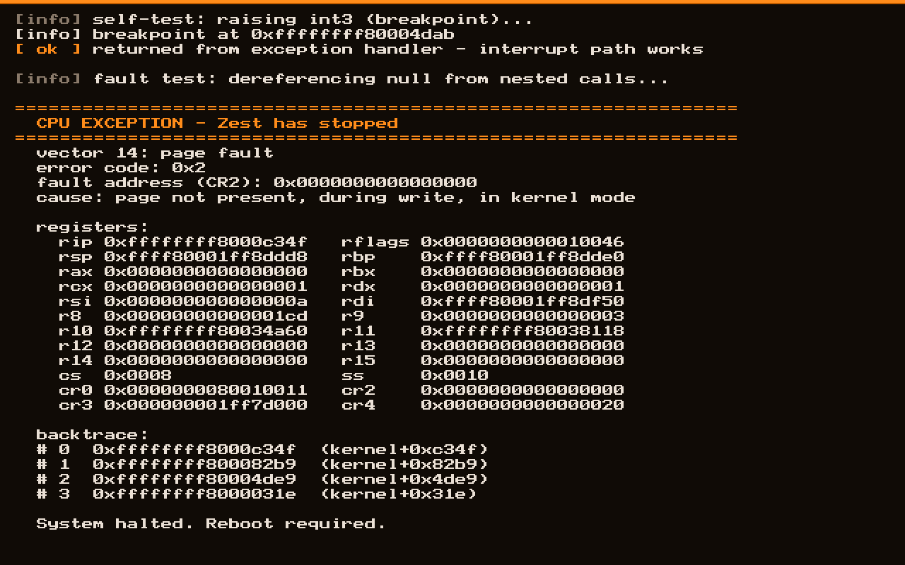

<div align="center">

# 🍊 Orange OS

**A modern operating system, written from scratch.**

*No Linux. No BSD. No inherited code. Every line ours.*

[](LICENSE)
[](ARCHITECTURE.md)
[](https://ziglang.org)
[](ARCHITECTURE.md#16-development-roadmap)

**[📐 Read the Architecture](ARCHITECTURE.md)**



</div>

---

## What this is

Orange OS is a from-scratch operating system for `x86_64` — its own kernel, its
own C library, its own filesystem, its own display server, its own desktop.
It is not a Linux distribution and shares no code with any existing OS.

Three things define the project:

**Written from scratch.** Every line in the kernel and core userland is ours.
That gives total control over the hardware, the software, and the licensing.

**Radically lightweight.** The full desktop targets **under 128 MB of RAM at
idle** and a **sub-2-second boot**. These are CI-enforced budgets, not
aspirations — a change that regresses them fails the build.

**Beautiful by design.** Compositing, animation, and typography are Phase 0
concerns, not something bolted on later.

---

## Architecture at a glance

```
  APPLICATIONS      Squeeze · Files · Settings · Editor · Monitor
  TOOLKIT           Segment       widgets, layout, text, theming
  DESKTOP           Grove         panel, dock, launcher
  DISPLAY SERVER    Peel          compositor, window mgmt, input
  SERVICES          Seed (init) · devmgr · netd · audiod · logd
  C LIBRARY         Pulp          libc + syscall stubs
  ══════════════════════════════════════════════════ ring 3 / ring 0
  KERNEL            Zest          sched · mm · vfs · ipc · drivers
  ARCH LAYER        x86_64        GDT · IDT · paging · APIC
  BOOT              Limine        UEFI / BIOS
```

Every component has a citrus name. Full detail — including the complete file
tree, memory layout, syscall ABI, and IPC model — is in
**[ARCHITECTURE.md](ARCHITECTURE.md)**.

| Name | Component |
|------|-----------|
| **Zest** | The kernel |
| **Pulp** | C standard library |
| **Seed** | init, PID 1 |
| **Peel** | Display server / compositor |
| **Segment** | Widget toolkit |
| **Grove** | Desktop shell |
| **Squeeze** | Terminal emulator |
| **Juice** | Command-line shell |
| **Crate** | Package manager |
| **CitrusFS** | Native filesystem |
| **Marmalade** | Debug and trace subsystem |

---

## Status

**Phase 6 complete.** **Seed** runs as PID 1, starts services from
`/etc/seed.conf`, and restarts them when they exit. Processes talk to each
other over capability-scoped IPC ports and share memory without the kernel
copying a byte. **Juice** is the shell.

| Phase | Milestone | Status |
|-------|-----------|--------|
| 0 | Boot, serial, framebuffer | ✅ **Done** |
| 1 | GDT, IDT, exception handling | ✅ **Done** |
| 2 | Memory management | ✅ **Done** |
| 3 | Interrupts and time | ✅ **Done** |
| 4 | Processes and scheduling | ✅ **Done** |
| 5 | Storage and filesystems | ✅ **Done** |
| 6 | Userland, IPC, and Seed | ✅ **Done** |
| 7 | **Graphics — the desktop** | 🔨 In progress |
| 8 | SMP, networking, USB, audio | ⬜ Planned |
| 9 | Real hardware | ⬜ Planned |

See the [full roadmap](ARCHITECTURE.md#16-development-roadmap) for what each
phase contains and honest time estimates.

---

## Building

**Requirements** (macOS):

```bash
brew install qemu xorriso zig@0.14 && brew link --overwrite zig@0.14
```

> **Zig 0.14.1 is required — not 0.16.** Zig 0.16's bundled LLD segfaults when
> linking any freestanding x86_64 binary, and its self-hosted ELF linker
> silently ignores linker scripts, which places the kernel at `0x1000000`
> instead of the higher-half address `-mcmodel=kernel` requires. 0.14.1 handles
> both correctly.

Then fetch the bootloader, create a disk, and build:

```bash
./scripts/fetch-limine.sh && ./scripts/mkdisk.sh && zig build run
```

| Command | What it does |
|---------|--------------|
| `zig build` | Compile and assemble `build/orange.iso` |
| `zig build run` | Boot in QEMU with serial on stdio |
| `zig build debug` | Boot halted, GDB stub on `:1234` |
| `zig build trace` | Boot with interrupt and fault tracing |
| `zig build -Dtick-hz=100` | Lower the scheduler tick rate |
| `zig build -Dblk-test run` | Run block device read/write tests |
| `zig build -Dfs-test run` | Run filesystem tests |

> **A note on timer accuracy under emulation.** The scheduler tick is
> best-effort; timekeeping is not. QEMU's TCG emulation on a non-x86 host
> cannot service 1000 interrupts a second and drops roughly a third of them,
> which the kernel detects and reports at boot. Uptime and all timeouts derive
> from the TSC, so they stay correct regardless — only scheduling granularity
> is affected. Use `-Dtick-hz=100` for a clean tick rate under emulation.

**Debugging:**

```bash
gdb build/kernel.elf -ex 'target remote :1234' -ex 'break kmain'
```

Run the memory subsystem stress tests:

```bash
zig build -Dmm-test run
```

Exercise the fault path, then resolve the backtrace to function names:

```bash
zig build -Dfault-test run
```

```bash
./tools/symbolize/symbolize.py < build/serial.log
```

A page fault reports the faulting address, a decoded cause, every register, and
a frame-pointer backtrace:



---

## Design principles

1. **Correctness before performance** — a slow kernel that works can be optimized
2. **Explicit before clever** — kernel code is read at 3 AM chasing a triple fault
3. **No silent failure** — every fallible operation returns an error
4. **One allocator per purpose** — never mix allocation domains
5. **Architecture behind a wall** — porting must touch exactly one directory
6. **The desktop is not privileged** — if the compositor dies, the system lives
7. **Measure every byte** — memory footprint is a tracked CI budget

---

## License

Dual-licensed under either:

- **[Apache License 2.0](LICENSE-APACHE)** — includes an explicit patent grant
- **[MIT License](LICENSE-MIT)** — short and permissive

at your option. `SPDX-License-Identifier: MIT OR Apache-2.0`

---

<div align="center">

### Official Vishwateja

**Developed by Vishwateja S B**
*Software Developer and AI Data Analyst*

Copyright © 2026 Official Vishwateja

---

🍊

*Written from scratch. Every layer. On purpose.*

</div>
