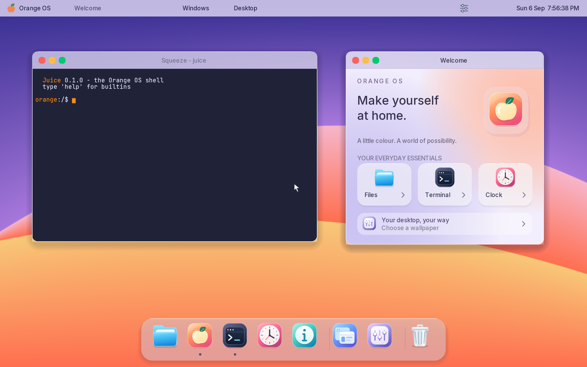

<div align="center">

# 🍊 Orange OS

**A modern operating system, written from scratch.**

*An independent kernel, filesystem, and desktop. No Linux or BSD base.*

[](LICENSE)
[](ARCHITECTURE.md)
[](https://ziglang.org)
[](ARCHITECTURE.md#16-development-roadmap)

**[📐 Read the Architecture](ARCHITECTURE.md)**



</div>

---

## What this is

Orange OS is a from-scratch operating system for `x86_64` — its own kernel, its
own C library, its own filesystem, its own display server, its own desktop.
It is not a Linux distribution and shares no code with any existing OS.

Three things define the project:

**Written from scratch.** The kernel and core userland are original project
code. The desktop uses openly licensed Inter and JetBrains Mono typefaces; their sources,
license, and reproducible coverage-atlas generator are included in the repo.

**Room for a rich desktop.** The baseline is **3 GiB RAM and 2 CPU cores**,
with GPU acceleration and larger profiles allowed when justified. Memory,
CPU use, and latency remain measured; the old 128 MiB / 1% limits no longer
block UI improvements. See the [resource policy](ARCHITECTURE.md#162-resource-policy-revised-september-6-2026).

**Beautiful by design.** Compositing, animation, and typography are Phase 0
concerns, not something bolted on later.

---

## Architecture at a glance

```
  APPLICATIONS      Squeeze · Files · Settings · Editor · Monitor
  TOOLKIT           Segment       widgets, layout, text, theming
  DESKTOP           Grove         panel, dock, launcher
  DISPLAY SERVER    Peel          compositor, window mgmt, input
  SERVICES          Seed (init) · devmgr · netd · audiod · logd
  C LIBRARY         Pulp          libc + syscall stubs
  ══════════════════════════════════════════════════ ring 3 / ring 0
  KERNEL            Zest          sched · mm · vfs · ipc · drivers
  ARCH LAYER        x86_64        GDT · IDT · paging · APIC
  BOOT              Limine        UEFI / BIOS
```

Every component has a citrus name. Full detail — including the complete file
tree, memory layout, syscall ABI, and IPC model — is in
**[ARCHITECTURE.md](ARCHITECTURE.md)**.

| Name | Component |
|------|-----------|
| **Zest** | The kernel |
| **Pulp** | C standard library |
| **Seed** | init, PID 1 |
| **Peel** | Display server / compositor |
| **Segment** | Widget toolkit |
| **Grove** | Desktop shell |
| **Squeeze** | Terminal emulator |
| **Juice** | Command-line shell |
| **Crate** | Package manager |
| **CitrusFS** | Native filesystem |
| **Marmalade** | Debug and trace subsystem |

---

## Status

**Daybreak desktop.** A colourful desktop with three procedural wallpapers,
smooth Inter typography, a frosted-glass app dock, a top menu/status bar, and
rounded windows with soft shadows. The controls work: close, minimize and
restore, zoom, switch apps, reveal the desktop, and choose a wallpaper.
Welcome, Terminal, Clock, and About share the new visual language.
The dock now includes **Files and Trash**, with richer shared icons and a
redesigned Welcome hub. Original SVG app/interface icons, full-colour gradients,
and real CPU backdrop blur now replace flat artwork and tint-only shell panels.
Welcome, Clock, and About use rounded glass cards. Files browses real guest folders and previews text;
Trash inspects `/Trash`. Both are currently read-only—move, restore, and
permanent deletion are not yet supported.
The desktop now renders at **2560×1600 with a 2x backing scale**, including
antialiased terminal text and pointer geometry. The top-right corner shows
the **real weekday, date, and live time** from the hardware clock, using
India time by default (`-Dtimezone-minutes=330`).

This is the first complete desktop-shell pass, not macOS feature parity.
See [Daybreak's controls and current limits](docs/design/007-daybreak.md).

**Input responsiveness.** Relative pointer travel is independent of Retina
scaling, sleeping input consumers wake promptly, and unchanged menu/dock glass
and shadows are cached. Rapid-input checks now include queue-to-publication
delay. Large-window dragging remains slow under x86 emulation on Apple Silicon;
see the [measured results and remaining work](docs/design/009-desktop-performance.md).

**Phase 9e complete.** Orange OS now idles a full two-core desktop at
**0.28% CPU** with the high-DPI frosted desktop and live clock in the latest resource-budget run. This is an idle measurement, not an interaction frame-rate claim. Scheduler sleeps, IPC,
console and PTY reads, and the Peel compositor all block until real work
arrives; a static desktop no longer keeps every core runnable. UEFI/NVMe boot,
panic replay, and the complete size, memory, latency, and idle-CPU budget
remain checked end to end.

| Phase | Milestone | Status |
|-------|-----------|--------|
| 0 | Boot, serial, framebuffer | ✅ **Done** |
| 1 | GDT, IDT, exception handling | ✅ **Done** |
| 2 | Memory management | ✅ **Done** |
| 3 | Interrupts and time | ✅ **Done** |
| 4 | Processes and scheduling | ✅ **Done** |
| 5 | Storage and filesystems | ✅ **Done** |
| 6 | Userland, IPC, and Seed | ✅ **Done** |
| 7a | PS/2 input, framebuffer handoff, and the Peel compositor | ✅ **Done** |
| 7b | Peel display protocol | ✅ **Done** |
| 7c | Pseudo-terminals and the Squeeze terminal emulator | ✅ **Done** |
| 7d | Segment widget toolkit and the Grove launcher | ✅ **Done** |
| 8a | SMP: every processor boots | ✅ **Done** |
| 8b | Cross-CPU scheduling | ✅ **Done** |
| 8c | Networking: e1000, ARP, IPv4, and ICMP | ✅ **Done** |
| 8d | UDP sockets, DHCP, and DNS | ✅ **Done** |
| 8e | TCP: fetching a page over a real handshake | ✅ **Done** |
| 8f | Intel HD Audio | ✅ **Done** |
| 8g-a | xHCI controller bring-up and device enumeration | ✅ **Done** |
| 8g-b | USB control transfers and device enumeration | ✅ **Done** |
| 8g-c | USB HID input | ✅ **Done** |
| 9a | UEFI boot from a single USB image | ✅ **Done** |
| 9b | NVMe storage | ✅ **Done** |
| 9c | Panic replay after compositor takeover | ✅ **Done** |
| 9d | Enforced resource-budget harness | ✅ **Done** |
| 9e | Blocking waits and <1% desktop idle CPU | ✅ **Done** |
| 9f | Booting physical hardware | 🔨 Next |

See the [full roadmap](ARCHITECTURE.md#16-development-roadmap) for what each
phase contains and honest time estimates.

### Measured resource budget

Measured by `./scripts/budget.sh` on QEMU q35 with 3 GiB, two processors,
UEFI, and an NVMe root disk (Daybreak desktop, September 6, 2026):

| Metric | Limit | Measured | Result |
|--------|------:|---------:|--------|
| Kernel image | < 2 MB (goal) | **0.81 MB** | Pass, advisory |
| `.bss` | < 512 KB (goal) | **171 KB** | Pass, advisory |
| Full desktop idle memory | ≤ 3 GiB | **81.19 MB** | Pass |
| Full desktop idle CPU | < 1% (goal) | **0.28%** | Pass, advisory |
| Context switch | < 500 ns | **59 ns** | Pass † |
| Syscall round-trip | < 200 ns | **159 ns** | Pass † |
| Boot to scheduler | < 2 s | **2.164 s** | Over † |

† Development runs QEMU's TCG x86_64 emulation on Apple Silicon. Timing is
reported rather than failed until it can be measured on native hardware; the
RAM ceiling is the resource gate; other thresholds are advisory. Launchers
and this measurement use the new 3 GiB / 2-vCPU baseline.

---

## Building

**Requirements** (macOS):

```bash
brew install qemu xorriso zig@0.14 && brew link --overwrite zig@0.14
```

> **Zig 0.14.1 is required — not 0.16.** Zig 0.16's bundled LLD segfaults when
> linking any freestanding x86_64 binary, and its self-hosted ELF linker
> silently ignores linker scripts, which places the kernel at `0x1000000`
> instead of the higher-half address `-mcmodel=kernel` requires. 0.14.1 handles
> both correctly.

Then fetch the bootloader, create a disk, and build:

```bash
./scripts/fetch-limine.sh && ./scripts/mkdisk.sh && zig build run
```

| Command | What it does |
|---------|--------------|
| `zig build` | Compile and assemble `build/orange.iso` |
| `./scripts/run-desktop.sh` | Run the built desktop; full screen with one guest cursor on macOS |
| `python3 tools/desktop_smoke.py` | Headless QEMU desktop interaction checks and screenshots |
| `zig build run` | Boot in QEMU with serial on stdio |
| `zig build debug` | Boot halted, GDB stub on `:1234` |
| `zig build trace` | Boot with interrupt and fault tracing |
| `zig build -Dtick-hz=100` | Lower the scheduler tick rate |
| `zig build -Dblk-test run` | Run block device read/write tests |
| `zig build -Dfs-test run` | Run filesystem tests |

For the new desktop, run `zig build && ./scripts/mkdisk.sh`, then
`./scripts/run-desktop.sh`. Click an app in the dock to launch, focus, or
restore it. The Orange OS menu also opens a **new** terminal. **F3** shows
all windows, **F4** opens Appearance, **F11** reveals/restores the desktop,
and **Escape** dismisses a panel. On a Mac, function keys may require `Fn`.

Userland defaults to `ReleaseSafe` when the kernel is built in Debug mode,
so software graphics remain responsive while retaining bounds checks. Use
`zig build -Duser-optimize=Debug` to debug userland instruction by instruction.
Inter's atlas is checked in; ordinary builds do not require Python imaging
libraries or network access.

Add `-smp 4` to the QEMU command line to boot with four processors,
`-netdev user,id=n0 -device e1000,netdev=n0` for networking, and
`-audiodev wav,id=snd0,path=out.wav -device intel-hda -device hda-output,audiodev=snd0`
to record what the machine plays. Add
`-device qemu-xhci,id=xhci -device usb-kbd,bus=xhci.0` for USB.

> **A note on timer accuracy under emulation.** The scheduler tick is
> best-effort; timekeeping is not. QEMU's TCG emulation on a non-x86 host
> cannot service 1000 interrupts a second and drops roughly a third of them,
> which the kernel detects and reports at boot. Uptime and all timeouts derive
> from the TSC, so they stay correct regardless — only scheduling granularity
> is affected. Use `-Dtick-hz=100` for a clean tick rate under emulation.

**Debugging:**

```bash
gdb build/kernel.elf -ex 'target remote :1234' -ex 'break kmain'
```

Run the memory subsystem stress tests:

```bash
zig build -Dmm-test run
```

Exercise the fault path, then resolve the backtrace to function names:

```bash
zig build -Dfault-test run
```

```bash
./tools/symbolize/symbolize.py < build/serial.log
```

A page fault reports the faulting address, a decoded cause, every register, and
a frame-pointer backtrace:


---

## Design principles

1. **Correctness before performance** — a slow kernel that works can be optimized
2. **Explicit before clever** — kernel code is read at 3 AM chasing a triple fault
3. **No silent failure** — every fallible operation returns an error
4. **One allocator per purpose** — never mix allocation domains
5. **Architecture behind a wall** — porting must touch exactly one directory
6. **The desktop is not privileged** — if the compositor dies, the system lives
7. **Measure every byte** — memory footprint is a tracked CI budget

---

## License

Dual-licensed under either:

- **[Apache License 2.0](LICENSE-APACHE)** — includes an explicit patent grant
- **[MIT License](LICENSE-MIT)** — short and permissive

at your option. `SPDX-License-Identifier: MIT OR Apache-2.0`

---

<div align="center">

### Official Vishwateja

**Developed by Vishwateja S B**
*Software Developer and AI Data Analyst*

Copyright © 2026 Official Vishwateja

---

🍊

*Written from scratch. Every layer. On purpose.*

</div>
