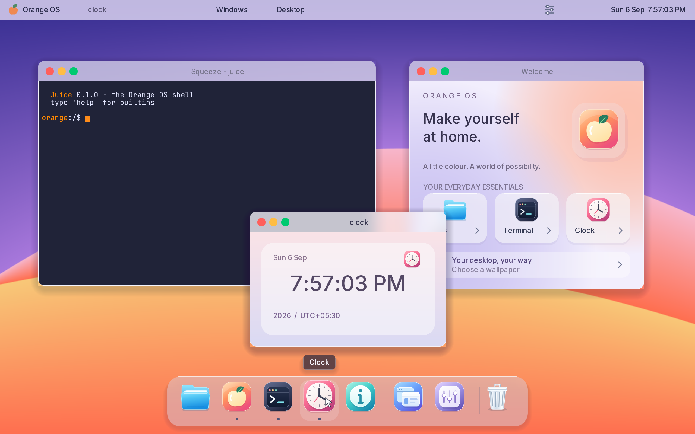
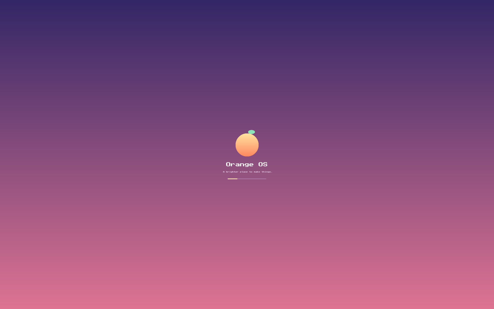
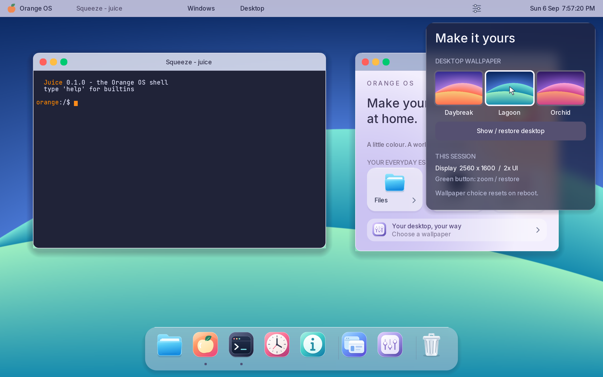
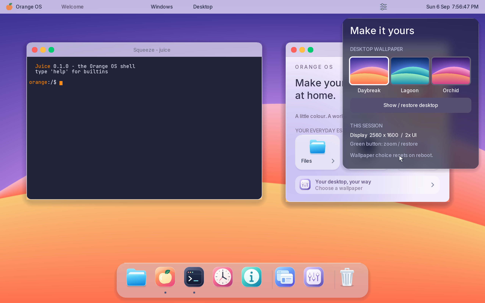
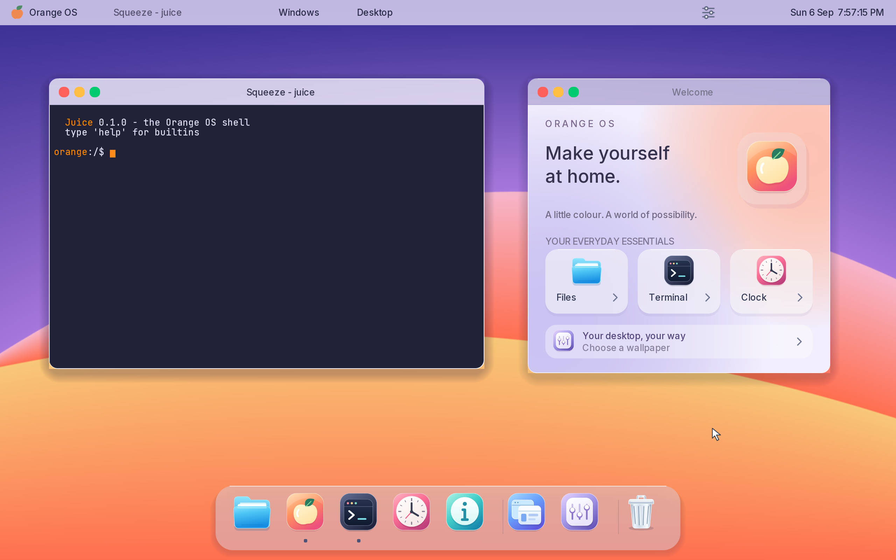
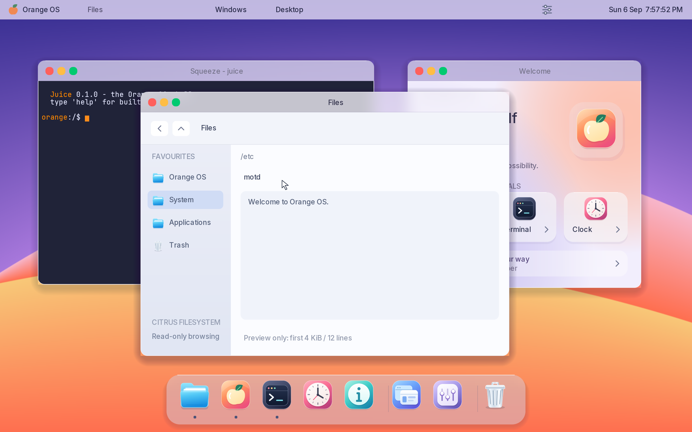
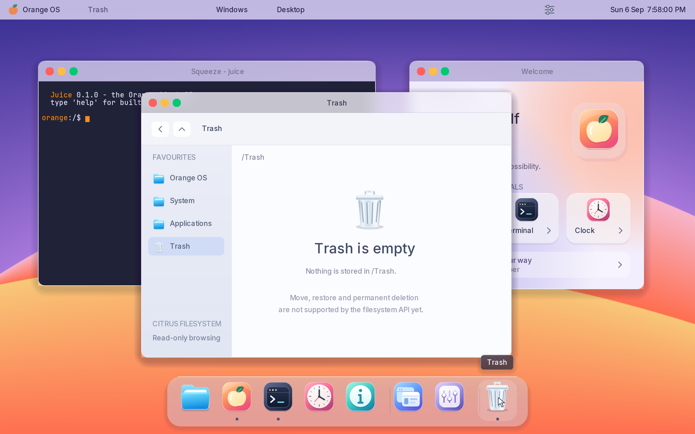

# Daybreak: the colourful OrangeOS desktop

Daybreak is the first integrated desktop-shell pass: an original colourful
visual identity inspired by macOS's hierarchy and window controls, running
on OrangeOS's own compositor, processes, IPC, and framebuffer.
















## What works

- A colourful startup splash with four real initialization stages. Serial
  diagnostics remain available. Test builds retain the text boot console;
  panic handling reclaims the display and replays the retained boot log.
- Three cached image-backed themes: Coastal Glass, Citrus Atelier, and Midnight
  Aurora. Peel reads 1280×800 BMP resources from CitrusFS, scales them once to
  native resolution at boot (about 47 MiB of cached surfaces plus 9 MiB source
  storage at 2560×1600), and Appearance changes shell materials, text, accents, and
  window title bars as well as the wallpaper. The selection is session-only.
- A top menu/status bar showing the active window and a live weekday, date,
  and 12-hour clock at the far right. Click the date/time to open Calendar;
  the adjacent sliders open Appearance.
- An eight-icon pearl-translucent dock: Files, Welcome, Terminal, Clock,
  About, Windows, Appearance, and Trash. Separators distinguish applications,
  desktop utilities, and Trash. Hover enlarges the icon and reveals its label.
  Application icons launch, focus, or restore an existing window; dots show
  which built-in apps have windows. Hover highlights and labels identify apps.
- Actual software backdrop blur in the dock, menu bar, window title bars,
  menus, overview, and Appearance. Glass uses diffused underlying content,
  translucent tints, rounded edges, and fine highlights.
- Red closes, yellow minimizes, and green zooms/restores a window. Dragging
  off a control before releasing cancels it. Windows stay reachable while
  dragging. Keyboard focus skips minimized windows.
- Window overview includes live client thumbnails and restores minimized
  windows. Thumbnails and rounded wallpaper swatches render at backing
  resolution rather than doubling logical pixels. Show Desktop restores
  the windows it previously hid.
- Rounded frames, soft shadows, antialiased text, rounded toolkit buttons,
  and restyled Welcome, About, Clock, and Terminal applications.
- Native 2560×1600 backing pixels for a 1280×800 logical workspace: actual
  2x font rasterization, rounded edges, and an antialiased SVG pointer.
  Terminal text uses antialiased JetBrains Mono instead of the 8×8 bitmap font.
- Original SVG artwork gives apps consistent highlights, depth, and silhouettes.
  Eight app icons and ten interface symbols replace glyph-based substitutes.
  Welcome has a peach/lilac aurora, an inset glass hero, frosted launch cards,
  compact Windows/Trash/About shortcuts, and an Appearance link. About and
  Clock share the softer glass-card styling.
- A frosted calendar panel shows the real local date/time, highlighted today,
  and the correct Gregorian month grid. Previous/next month, Today, and Open
  Clock work; blank panel clicks are inert. This is a date browser, not an
  event/reminder application. The panel clock updates each minute, while the
  menu-bar clock continues to show seconds.
- A read-only Files browser with sidebar favourites, back/up navigation,
  directory paging, real grid/list switching, original coloured SVG folder
  icons and text previews. The Trash dock icon opens `/Trash`.

## Controls

| Action | Control |
|---|---|
| Launch/focus/restore app | App's dock icon |
| Open another terminal | Orange OS menu → New terminal |
| Switch or restore any window | Windows menu, dock Windows icon, or F3 |
| Appearance and wallpaper | Appearance menu, dock sliders icon, or F4 |
| Reveal/restore desktop | Desktop menu or F11 |
| Calendar, month browsing, Today | Top-right date/time |
| Open Clock from Calendar | Open Clock button (or Clock in the dock) |
| Cycle visible windows | Tab |
| Dismiss a desktop panel | Escape or a click outside it |
| Zoom/restore a window | Green title-bar button |
| Browse the guest filesystem | Files dock icon or Welcome's Files card |
| Inspect Trash | Trash icon at the far right of the dock |
| Files: back / dismiss preview | Back button or Backspace; Escape dismisses preview |

## Implementation

### Three visual directions

The user selected all three numbered design concepts. Appearance exposes the
corresponding Coastal, Citrus, and Aurora choices, with native guest captures:
[Coastal](../screenshots/theme-coastal.png),
[Citrus](../screenshots/theme-citrus.png), and
[Aurora](../screenshots/theme-aurora.png). These are newly generated clean
wallpaper assets inspired by the approved concepts plus native compositor
materials. The source PNGs are in `assets/wallpapers/`, the 24-bit guest BMPs
in `userland/servers/peel/assets/`, and the compositor caches all three
backgrounds at boot; pointer movement never decodes or scales them.

The [Files grid capture](../screenshots/theme-files-grid.png) shows actual
CitrusFS entries; it does not invent Desktop, Documents, Music or item counts
merely to match the concept art. Grid/list controls share the same backing
directory data, selection hits, paging and preview action. The folder art is
reproducibly rasterised from five new project SVGs at high-DPI size.

This is a shell/theme milestone, not complete application theming or macOS
feature parity. Existing clients still own their light content pixels; a dark
Aurora title bar can therefore frame a light Welcome or Files view. A shared
theme notification protocol, client palettes, persistent preferences, a real
browser, and genuine host-device controls remain separate production-plan
work. On the 2-vCPU QEMU TCG test profile, theme switching still incurs a
roughly 500 ms full-screen recomposition, while ordinary interaction tests
pass. Cached wallpaper generation does not remove that whole-scene cost.

### Reference-inspired Welcome and Calendar

The supplied React desktop reference informed the inset glass hero, compact
utility strip, layered launch cards, and a right-aligned calendar/date tile.
These are native compositor/client features, not a webpage embedded in the OS.
All icons remain SVG-derived artwork. The reference's simulated wireless,
weather and browser controls were not presented as real hardware or services.

Welcome builds expensive glass/gradient content in a private frame first and
only copies the finished result into its shared surface. Pointer transitions
that do not alter a hover/pressed target do not repaint. The shared copy is
not an atomic buffer swap; broader frame-publication synchronization remains
separate compositor work.

Calendar uses the same civil-time conversion as the menu-bar clock, including
the configured timezone and Gregorian leap years. Month browsing is limited
to 100 years either side of today and clamped to the supported 1970–2399
conversion range. Returning to Today resets the offset. No new polling loop
was added: the existing wall-clock check damages the panel once per minute.

Reproduce the new interaction checks with a profile build and rebuilt disk:
`python3 tools/welcome_smoke.py` and `python3 tools/calendar_smoke.py`.

7 September 2026 performance correction: the original 541–667 ms calendar
redraws were caused by scene-wide damage, repeated shadow work and Clock
publishing its whole client every second. The fix uses separately owned raw
backdrop, shadow, material and finished-content layers. Button/month/minute
updates restore material directly; background commits refresh their precise
region before repainting the glass. Opening attaches the panel to the retained
scene. Dismissal restores current client content, not an old screenshot.

The shared frost renderer now uses exact rolling-sum box blur, reused horizontal
interpolation and a conservative eight-cell dirty halo. Only the compositor's
trusted source-damage hint skips unchanged comparisons; ordinary callers still
compare the complete source. Pixel-equivalence tests cover both backing scales,
clamped edges, local patches, partial clips and cache invalidation. Text drawing
skips clipped glyph pixels, including safe handling of the unbounded Retina clip.
Clock builds text privately over a cached background and publishes only changed
logical pixel bounds. This reduces exposure to partially constructed frames,
but is **not** the general atomic client-buffer publication protocol.

Acceptance: `python3 tools/calendar_perf.py --stress`, built with
`-Ddesktop-profile`, on 3 GiB / 2 vCPU QEMU TCG. With eight windows and a live
Clock behind the calendar, 146 warm nonempty frames measured **41 ms p95,
45 ms maximum**; month navigation maximum **43 ms**. Cold opening **109 ms** is
reported separately, not included in the warm gate. The test requires p95 below
50 ms and maximum at most 100 ms, verifies live pixels through glass and saves
diagnostic results. Run without `--stress` for static restored-pixel comparison;
`--quick` is diagnostic only. These are guest compositor-work measurements,
not end-to-end latency, 60 Hz proof, or a guarantee for arbitrary workloads.

Calendar's four retained layer buffers reserve about 17.8 MB, plus its existing
5.6 MB material cache; Clock uses about 2.4 MB for two private buffers. They are
bounded and reused, within the user's 3 GiB baseline. Broader client-publication
and other-app flicker gates remain open independently of this calendar fix.

### Shell ownership

Peel owns the dock and menus so their hit testing, z-order, focus, minimized
state, and app lifecycle use one source of truth. Grove is now a closable
Welcome hub; it asks Peel to launch apps instead of maintaining a competing
singleton list. Seed starts Welcome and the initial terminal once.

`desktop.zig` shares layout functions between drawing and hit testing. The
compositor renders completed damage regions off-screen before presenting.
Wallpaper is cached in a separate shared-memory surface. Shadow drawing is
restricted to the visible fringe. Minimized client commits do not repaint
the desktop, except when their thumbnails are visible in overview.

The Windows overview holds a captured desktop backdrop while its previews
remain live. Hover updates restore only the old/new cards from the cached
glass; thumbnails are cached by stable window ID and commit revision.
Background apps keep executing, including minimized apps. Dismissing the
overview reconstructs the desktop from their latest buffers. Window-list changes
refresh the overview base. This avoids a live clock continually rebuilding the
entire frosted multi-window scene. See the eight-window measurements in
[desktop performance](009-desktop-performance.md#eight-window-overview).

The green button scales the existing client surface into the available
desktop area and transforms mouse coordinates back into client space. This
keeps real buttons functional without claiming to support app reflow yet.

The shared Inter renderer uses an embedded coverage atlas generated from
the included font; ordinary builds have no download or Pillow dependency.
The font and atlas are SIL OFL 1.1, with the license included in the source
tree and the guest disk. The renderer and OS code keep the project licenses.
Terminal's JetBrains Mono atlas and license are included in the same way.

### Civil time

The boot CPU reads the CMOS RTC before starting other CPUs, using bounded
stable-snapshot retries, BCD/binary decoding, and 12/24-hour conversion. It
anchors Unix seconds to monotonic time; syscall 62 exposes that separate
wall clock. Missing or invalid RTC data displays "Clock unavailable", never
a fabricated date. The UI refreshes once per second.

The RTC is assumed UTC. `scripts/run-desktop.sh` explicitly starts QEMU with
`-rtc base=utc,clock=host`, as described in the
[QEMU invocation reference](https://www.qemu.org/docs/master/system/invocation.html).
The preview defaults to India time (UTC+05:30); build with
`zig build -Dtimezone-minutes=0` for UTC or another fixed offset in minutes.
There is no NTP synchronization, automatic DST, or timezone settings UI yet.

### Backing scale

Limine requests 2560×1600. Peel uses a 2x backing scale when the framebuffer
supports it; smaller modes retain 1x drawing. Layout, damage rectangles, and
client input remain logical coordinates. Clients query the scale before
allocating their shared buffers. Painting, surface copies, and glyph coverage
operate in physical pixels; relative pointer travel is independent of backing scale.
The buddy allocator now supports 16 MiB blocks and the shared-memory cap is
16 MiB, sufficient for each 2560×1600 32-bit compositor surface.

### Shared artwork, Files, and Trash

`assets/icons/*.svg` contains original app and interface artwork, not Apple
assets or Unicode emoji. `tools/iconconv/desktop_icons.py` bakes it at 192 px
for apps and 48 px for interface symbols into the checked-in 1.21 MiB RGBA
atlas. Full colour avoids palette banding; premultiplied-alpha bilinear sampling
preserves transparent antialiased edges. Normal builds do not require CairoSVG.
`userland/libs/desktop-ui/ui.zig` draws the artwork and supplies press/release
capture shared by Welcome, About, and Files/Trash. Inter uses medium weight
500; JetBrains Mono remains the terminal face. Neither font is Apple's
proprietary San Francisco.

### Frosted materials

Window-body polish: the content now owns one continuous 13-point lower-corner
silhouette, inspired by the user's rounded/overflow-clipped web UI reference.
There is no pale frame undercoat beneath a differently rounded client mask.
Client edge colours extend into the one-point rim, and 4x4 subpixel coverage
blends the curved edge once against the actual backdrop. Shadows also cover the
small cutouts inside the window bounds instead of ending at a square rectangle.
Bulk row copies remain enabled for the ordinary interior; zoom, partial damage,
off-screen dragging and live edge updates use the same body path. Native tests
cover symmetry, clipping, source alignment and absence of pale corner wedges.
The reference is design inspiration, not a React runtime or simulated-app port.

The CPU renderer downsamples the current backdrop, applies two separable
box-blur passes, bilinearly reconstructs it at physical resolution, then adds
a material tint and antialiased rounded mask. Two reused scratch arrays are
bounded to 384×256 pixels each (768 KiB total per process using blur).
Sampling clamps within the panel's visible rectangle; no external halo is read.

Peel expands damage to a fixed point across intersecting glass surfaces,
reconstructs the underlying layers, and only then samples their backdrop.
It presents the entire expanded region from its completed back buffer.
This prevents repeated blur accumulation and old cursor pixels feeding the
next glass frame while preserving small client-only updates.

Client glass cards blur their own app background; the client protocol does
not yet support transparent client surfaces revealing other apps. Title bars,
the dock, and shell panels do diffuse actual windows/wallpaper underneath.
The effect is software-rendered, not GPU acceleration or a macOS material API.

### Responsiveness

Peel now keeps its scene buffer cursor-free and draws pointer-only updates
without recompositing glass. A bounded damage set preserves distant updates,
and unscaled client rows use bulk copies. Non-Debug userland executables omit
debug information to reduce disk-loading work. See the
[measured performance pass](009-desktop-performance.md) for before/after
results and remaining dragging latency; this is not yet a 60 Hz claim.

Files reads the actual guest VFS. Favourites open `/`, `/etc`, `/bin`, and
`/Trash`; directories are sorted before files, with `.` and `..` hidden.
Listings display eight rows per page. The current readdir syscall returns
at most 32 entries (including dot entries); the UI explicitly labels a
capped listing. Preview displays up to 4 KiB / 12 lines of ASCII text;
binary and non-ASCII contents receive an unsupported-preview message.

The build creates an empty `/Trash` directory. Trash reads that directory
and shares the same browser code, rather than inventing trashed items.
**Move to Trash, restore, and permanent deletion are not implemented:** the
current userland filesystem API does not expose the required safe mutations.
There is deliberately no enabled Empty Trash button and no host files are
mounted into this view. Neither Files nor Trash modifies filesystem contents.

## Verification

Build and run `python3 tools/desktop_smoke.py`. It starts QEMU with disposable
disk writes, injects real mouse/key events, checks serial lifecycle events and
framebuffer pixels, and retains screenshots and logs in a temporary directory.
It covers startup, dock singleton launches, minimize/restore, zoom/restore,
scaled client input, app close/relaunch, show desktop, wallpaper selection,
overview restoration, cancelled close, and dragging.
It also checks wall time against the host, visible clock ticking, and native
2x text detail. `zig test userland/libs/pulp/calendar.zig` covers every day
from 1970 through 2399, leap years, and timezone midnight rollover;
`zig test userland/servers/peel/gfx.zig` checks 2x damage clipping, real blur
diffusion, reconstruction stability, and glass dependency expansion.

For panic replay, build with `zig build -Dlate-fault`, recreate the disk, and
run `python3 tools/desktop_smoke.py --panic`. Rebuild normally afterwards.
`./scripts/budget.sh` checks UEFI/NVMe boot and the resource limits.
The current default VM profile is 3 GiB RAM / 2 vCPUs. More resources and
GPU acceleration are authorized when justified, per ARCHITECTURE.md §16.2;
the current desktop still uses a CPU renderer. `ORANGE_VM_RAM` and
`ORANGE_VM_CPUS` override the shell launcher/test profile.
The desktop smoke suite also exercises Files navigation, reading `/etc/motd`,
back navigation, Trash's real empty-directory view, singleton launch behavior,
and Welcome's Appearance link. It also verifies exact framebuffer stability
after repeated cursor damage over a frosted panel. Native tests exercise
every SVG sprite at 1x/2x, alpha clipping, and shared pointer capture:

```sh
zig test --dep gfx --dep typography \
  -Mroot=userland/libs/desktop-ui/ui.zig \
  -Mgfx=userland/servers/peel/gfx.zig \
  -Mtypography=userland/libs/typography/typography.zig
```

## Current limits and next layers

### Native UI refinement — 23 September 2026

Compared the actual Mac Finder window and desktop icons with the native guest.
The refinement uses quieter materials and tighter grouping, not transplanted
Apple assets: neutral application tiles, a blue folder silhouette, graphite
terminal/clock/window icons, a metal settings gear and mesh wastebasket. Sidebar
symbols are a separate original outline family; arbitrary rainbow directory
colors are no longer applied to system folders. The icon sources and constraints
are documented in `assets/icons/DESIGN.md`.

Welcome no longer presents every launcher as a raised marketing card. Files has
compact sidebar rows, navigation beside the current folder name, disabled-arrow
states, measured filename alignment, list column labels and a bottom path area.
Title text is actually centered; inactive window controls are muted. These edits
preserve real actions, private-frame publication, and bounded hover damage.

Validation: shared UI tests (four), full desktop interactions, and the six-app
redraw audit pass. The audit observed zero changed samples across 144 blank-click
samples and zero client repaints for Welcome/About/Files/Trash. Evidence:
`orange-daybreak-mym4m3rd` (interactions), `orange-daybreak-6t2mgg2_` (audit).
QMP sampling is not a guarantee against every scanout artifact. Screenshots:
`docs/screenshots/refined-files.png` and `docs/screenshots/refined-welcome.png`.

This is a focused visual refinement, not complete macOS parity. A truly unified
client toolbar/titlebar protocol, theme-aware content in every app, keyboard
focus/accessibility and richer app functionality remain separate work.

- The high-DPI desktop is tested at 2560×1600 (1280×800 logical points).
  QEMU may still resample to fit a different host display size. Arbitrary
  monitor modes, runtime scale changes, and exact panel-native output are
  not implemented; this is not yet macOS's complete display pipeline.
- Wallpaper changes last for this boot; persistent desktop preferences are
  not implemented. Timezone is a build-time fixed offset.
- Window zoom scales pixels, not application layout. Live resizing, arbitrary
  app layouts, and fresh rendering at the zoomed size require a resize protocol.
- Eight windows are supported. Task/address-space and IPC object reclamation
  remain limited; indefinite launch/close stress is not supported yet.
- Panels use CPU backdrop blur, alpha blending, and soft shadows; there is no
  GPU acceleration, vertical synchronization, or general animation framework.
  Text coverage is ASCII. Zoomed client surfaces still scale their existing
  pixels; SVG sources are baked for the normal 1x/2x desktop, not parsed live.
- File mutations, a browser, editor, notifications, calendar events/reminders, audio/network controls,
  application search, and persistent settings remain subsequent app and
  service work. No nonfunctional controls stand in for those features.

The existing architecture roadmap includes longer-term plans beyond what
is implemented. Daybreak's concrete behavior and tests are listed here.
